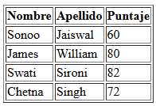
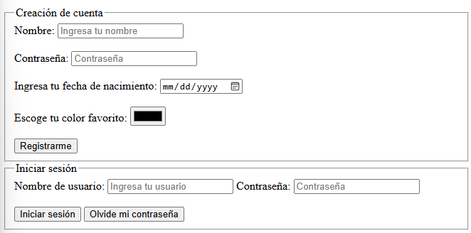

# Lenguaje HTML

## Encabezados
Los elementos de encabezado permiten especificar que ciertas partes del contenido son encabezados, o subencabezados del contenido. De la misma forma que un libro tiene un título principal, y que a su vez puede tener títulos por cada capítulo individual, y subtítulos dentro de ellos, un documento HTML puede tenerlos también. HTML posee seis niveles de encabezados `<h1>...<h6>`
```
<h1>Título principal</h1>
<h2>Título de nivel superior</h2>
<h3>Subtítulo</h3>
<h4>Sub-subtítulo</h4>
<h5>Sub-sub-subtítulo</h5>
<h6>Sub-sub-sub-subtítulo</h6>
```

## Párrafos
Los elementos `<p>` se utilizan para encerrar párrafos de texto.
```<p>Este es un párrafo</p>```

## Hipervínculos
La etiqueta **anchor** `<a>` en HTML define un hipervínculo que vincula una página a otra página. Puede crear un hipervínculo a otra página web, así como a archivos, ubicación o cualquier URL. El atributo **href** es el atributo más importante de la etiqueta `<a>` en HTML y la que vincula a una determinada página o URL.
```<a href=linkPagina>Click para ir a mi otra pagina web</a>```

Si queremos abrir ese enlace en otra página, podemos usar el atributo **target**. Con la ayuda de este atributo la segunda página se abrirá en otra ventana del navegador.
```<a href=linkPagina target=_blank>Link</a>```

## Imágenes
La etiqueta **img** se utiliza para mostrar una imagen en una página web, es una etiqueta vacía que solo contiene atributos, las etiquetas de cierre no se utilizan en el elemento img.
``````

### Formatos de imágenes recomendadas:


### Imagen con hipervínculo
Podemos enlazar una imagen con otra página o podemos usar una imagen como enlace. Para hacer esto, coloque la etiqueta `` dentro de la etiqueta `<a>`.
```
<a href=https://adip.cdmx.gob.mx/>
    
</a>
```

### Atributos de la etiqueta img en HTML
- **scr:** describe la fuente o ruta de la imagen. Le indica al navegador dónde buscar la imagen en el servidor. La ubicación de la imagen puede estar en el mismo directorio o en otro servidor. 

- **alt:** define un texto alternativo para la imagen, si no se puede mostrar. El valor del atributo describe la imagen en palabras.

- **width:** se utiliza para especificar el ancho para mostrar la imagen.

- **height:** se utiliza para especificar lo largo para mostrar la imagen.

#### Recursos para imágenes
- [Compresor de imágenes](https://tinypng.com/)
- [Descargar imágenes gratuitas](https://www.pexels.com/es-es/)

## Videos
HTML5 también admite la etiqueta `<video>`. La etiqueta de video en HTML se usa para transmitir archivos de video, como clips de películas, clips de canciones, en la página web.

```
<video src="ejemploVideo.mp4" controls autoplay loop height="50">
    Tu navegador no admite el elemento video.
</video>
```

### Atributos de la etiqueta video en HTML
- **controls:** agrega al video los controles necesarios para reproducir, pausar y adelantar.
- **preload = auto:** hace que el navegador descargue el video, en el momento en el que se acceda a la página.
- **autoplay:** se empezará a reproducir el video de manera automática.

## Iframe
El elemento `<iframe>` en HTML es como una “ventana” dentro de tu página web que permite mostrar otro documento HTML, como si incrustaras una página web dentro de otra. Es muy útil para integrar contenido externo sin redirigir al usuario.
`<iframe src=""></iframe>`

## Listas

Las listas HTML se utilizan para especificar listas de información. Todas las listas pueden contener uno o más elementos de lista. Hay tres tipos diferentes de listas HTML:

- **Lista Ordenada o Lista Numerada:** todos los elementos de la lista están marcados con números de forma predeterminada. La lista ordenada comienza con la etiqueta `<ol>` y los elementos de la lista comienzan con la etiqueta `<li>`.
```
<ol>
    <li>Linea 1</li>
    <li>Linea 2</li>
    <li>Linea 3</li>
    <li>Linea 4</li>
</ol>
```
- **Lista desordenada o lista con viñetas:** todos los elementos de la lista están marcados con viñetas. La lista desordenada comienza con la etiqueta `<ul>` y los elementos de la lista comienzan con la etiqueta `<li>`.
```
<ul>
    <li>Linea 1</li>
    <li>Linea 2</li>
    <li>Linea 3</li>
    <li>Linea 4</li>
</ul>
```
- **Lista de descripción o Lista de definición (dl):** es muy apropiada cuando se desea presentar un glosario o una lista de términos. La lista de definiciones en HTML contiene las siguientes tres etiquetas:
    - La etiqueta `<dl>`: define el inicio de la lista.
    - La etiqueta `<dt>`: define un término.
    - La etiqueta `<dd>`: define la definición del término (descripción).
```
<dl>
    <dt>Aries</dt>
        <dd>Uno de los 12 signos del horóscopo.</dd>
    <dt>Dona</dt>
        <dd>Uno de mis bocadillos favoritos.</dd>
    <dt>Leo</dt>
        <dd>También es uno de los 12 signos del horóscopo.</dd>
    <dt>Oracle</dt>
        <dd>Es una corporación multinacional de tecnología.</dd>
</dl>
```
Podemos crear una lista dentro de otra lista, que se denominará Lista anidada.

## Tablas
La etiqueta de `<table>` en HTML se utiliza para mostrar datos en forma tabular (fila*columna). Podemos crear una tabla para mostrar datos en forma tabular, usando el elemento `<table>`, con la ayuda de las etiquetas `<tr>, <td> y <th>`.
En cada tabla, la fila (row) de la tabla está definida por la etiqueta `<tr>`, el encabezado (header) de la tabla está definido por `<th>` y los datos (data) de la tabla están definidos por las etiquetas `<td>`.


```
<table>
    <tr>
        <th>Nombre</th>
        <th>Apellido</th>
        <th>Puntaje</th>
    </tr>
    <tr>
        <td>Sonoo</td>
        <td>Jaiswal</td>
        <td>60</td>
    </tr>
    <tr>
        <td>James</td>
        <td>William</td>
        <td>80</td>
    </tr>
    <tr>
        <td>Swati</td>
        <td>Sironi</td>
        <td>82</td>
    </tr>
    <tr>
        <td>Chetna</td>
        <td>Singh</td>
        <td>72</td>
    </tr>
</table>
```

### Tabla con caption
El título de una tabla en HTML se muestra encima de la tabla. Para colocarlo debe usarse la etiqueta `<caption>´ solo después de la etiqueta table.


```
<table border=1, style=width:100%>
    <caption>Registros de estudiantes</caption>
    <tr>
        <th>Nombre</th>
        <th>Apellido</th>
        <th>Puntaje</th>
    </tr>
    <tr>
        <td>Leticia</td>
        <td>Lopez</td>
        <td>70</td>
    </tr>
    <tr>
        <td>Miguel</td>
        <td>Cortes</td>
        <td>60</td>
    </tr>
    <tr>
        <td>Erica</td>
        <td>Robles</td>
        <td>42</td>
    </tr>
    <tr>
        <td>Ignacio</td>
        <td>Torres</td>
        <td>62</td>
    </tr>
</table>
```

### Tabla con colspan
Si deseas que una celda abarque más de una columna, puedes usar el atributo colspan sobre la etiqueta `<th>`. El atributo dividirá una celda en varias columnas, y el número de columnas dependerá del valor del atributo colspan.


```
<table style=width:100% border=1>
    <tr>
        <th>Nombre</th>
        <th colspan=2>No. Movil</th>
    </tr>
    <tr>
        <td>Omar Montoya</td>
        <td>55123456</td>
        <td>55654321</td>
    </tr>
</table>
```

### Tabla con rowspan
Si deseas que una celda abarque más de una fila, puedes usar el atributo rowspan sobre la etiqueta `<th>`. Este dividirá una celda en varias filas. El número de filas divididas dependerá de los valores de intervalo de filas.


```
<table style=width:100% border=1>
    <tr>
        <th>Nombre</th>
        <td>Omar Montoya</td>
    </tr>
    <tr>
        <th rowspan=2>No. Movil</th>
        <td>55123456</td>
    </tr>
    <tr>
        <td>55654321</td>
    </tr>
</table>
```

Ejercicios: realiza la codificación de la siguientes tablas.


# Formularios
Un formulario en HTML es una sección de un documento que contiene controles como campos de texto, campos de contraseña, casillas de verificación, botones de radio, botón de envío, menús, etc. Un formulario facilita al usuario ingresar datos que se enviarán al servidor para su procesamiento, como nombre, dirección de correo electrónico, contraseña, número de teléfono, etc. Se requieren formularios si desea recopilar datos. Por ejemplo: si un usuario desea comprar algunos artículos en Internet, debe completar un formulario, como la dirección de envío y los detalles de la tarjeta de crédito/débito, para que el artículo pueda enviarse a la dirección indicada.

La sintaxis de un formulario es: 
```
<form>
    <!--controles de entrada, campo de texto, área de texto, botes, etc.-->
</form>
```

## Input
Se utiliza para crear campos de formulario, para recibir información del usuario. El siguiente es un ejemplo para mostrar la entrada de texto simple.
```
<form>
    Introduce tu nombre:
    <input type="text"><br>
    Introduce tu contraseña:
    <input type="password">
</form>
```


## Label
Se considera usar `<label>` en `<form>` ya que hace que el código sea amigable para el analizador/navegador/usuario. Si haces clic en la etiqueta `<label>`, se centrará en el control de texto, esto tiene mayor funcionalidad en pantallas táctiles. Para hacerlo, debes tener el atributo *for* en la etiqueta `<label>` cuyo valor debe ser el mismo que el valor del atributo *id* de la etiqueta `<input>`.
```
<form>
    <label for="firstname">Nombre: </label>
    <input type="text" id="firstname"/>
    <br/>
</form>
```

## Select
Se utiliza para crear menús desplegables para que los usuarios puedan seleccionar el valor que deseen.
```
<label for="lang">Lenguaje</label>
    <select name="lenguajes" id="lang">
        <option value="javascript">JavaScript</option>
        <option value="php">PHP</option>
        <option value="java">Java</option>
        <option value="golang">Golang</option>
        <option value="python">Python</option>
        <option value="c#">C#</option>
        <option value="C++">C++</option>
        <option value="erlang">Erlang</option>
    </select>
```

## Control de botón de radio
El botón de radio se utiliza para seleccionar una opción entre múltiples opciones. Si usas un nombre para multiples botones de radio, solo se podrá seleccionar un botón de radio a la vez.
```
<form>
    <label for="opciones">Opciones:</label>

    <label for="opc1">Opción 1</label>
    <input type="radio" id="opc1" name="opciones"/>

    <label for="opc2">Opción 2</label>
    <input type="radio" id="opc2" name="opciones"/>

    <label for="other">Otro</label>
    <input type="radio" id="other" name="opciones"/>
 </form>
```

## Control de checkbox
Se utiliza para marcar múltiples opciones de casillas de verificación dadas.
```
<form>
    <span>Pasatiempo:</span>
    <input type="checkbox" id="sing">
    <label for="sing">Cantar</label>
    <input type="checkbox" id="videogames">
    <label for="videogames">Jugar videojuegos</label>
</form>
```

## Textarea
Se usa para insertar texto de varias líneas en un formulario. El tamaño se puede especificar usando el atributo rows o cols.
```
<form>
    <label for="cajaTexto">
        <span>Caja de texto</span>
        <textarea rows="5" cols="50" id="cajaTexto"></textarea>
    </label>
</form>
```

## Fieldset
Se usa para agrupar la información relacionada de un formulario. Este elemento se usa con el elemento `<legend>` que proporciona un título para los elementos agrupados.

