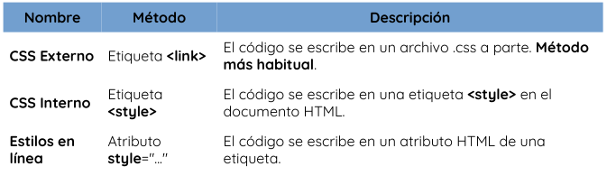
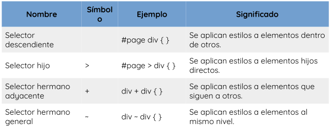

# Lenguaje CSS
Las *hojas de estilo en cascada*, tal es su traducción del inglés **Cascading Style Sheets (CSS)**, tienen como función establecer reglas de representación de un documento. Mediante estas reglas podremos establecer medidas, colores o cualquier otra característica de representación de una página web. Tres de los principales beneficios para el uso de CSS son:
- Resuelve un gran problema. Antes de CSS, las etiquetas como fuente, color, estilo de fondo, alineación de elementos, borde y tamaño tenían que repetirse en cada página web. Este era un proceso muy largo. 
- Ahorra mucho tiempo. Las definiciones de estilo CSS se guardan en archivos CSS externos, por lo que es posible cambiar todo el sitio web cambiando solo un archivo.
- Proporcionar más atributos. CSS proporciona atributos más detallados que usar simplemente HTML para definir la apariencia del sitio web.


Antes de comenzar a trabajar con CSS hay que conocer las diferentes formas para incluir estilos en nuestros documentos HTML, ya que hay varias, cada una con sus particularidades y diferencias.
En principio, tenemos tres formas diferentes de hacerlo, siendo la primera la más común y la última la menos habitual:



- **Enlace a CSS externo (link):** en la cabecera de nuestro documento HTML, podemos incluir una etiqueta `<link>` con la que establecemos una relación entre el documento actual y el archivo CSS que indicamos en el atributo `href`:
```
<!DOCTYPE html>
<html lang="es">
<head>
    <link rel="stylesheet" href="./css/style.css">
</head>
</html>
```

- **Incluir CSS en el HTML (style):** para incluir estilos CSS en nuestra página es la de añadirlos directamente en el documento HTML, a través de una etiqueta `<style>` que contendrá el código CSS:
```
<!DOCTYPE html>
<html>
    <head>
        <title>Título de la página</title>
        <style>
            div {
            background: hotpink;
            color: white;
            }
        </style>
    </head>
    <body>
        <div>
            <p>Hola Mundo</p>
        </div>
    </body>
</html>
```

- **Estilos en línea (atributo style):** a través del atributo style de la propia etiqueta donde queramos aplicar el estilo, colocando ahí las propiedades CSS:
```
<!DOCTYPE html>
<html lang="es">
<head>
    <meta charset="UTF-8">
    <meta name="viewport" content="width=device-width, initial-scale=1.0">
    <title>Lenguaje CSS</title>
</head>
<body>
    <div style="background-color: red;">2do Hola Mundo</div>
</body>
</html>
```

## Sintaxis básica
La estructura CSS se basa en reglas que tienen el siguiente formato: Debemos escribir el selector, abrir llaves, indicar la propiedad y posteriormente asignarle el valor correspondiente. Cerramos la línea con punto y coma, y seguimos agregando pares de propiedad/valor hasta que completemos la declaración (cada una debe estar finalizada con punto y coma). Cuando terminamos, cerramos la llave. La declaración sería entonces:
```
selector {
    propiedad:valor;
}
```
- **Selector:** es el elemento HTML que vamos a seleccionar del documento para aplicarle un estilo concreto, este podría ser el nombre un elemento, su clase o su identificador. 
- **Propiedad:** es una de las diferentes características que brinda el lenguaje CSS y que aplicaremos al selector para darle estilo.
- **Valor:** cada propiedad CSS tiene una serie de valores concretos a que se le pueden asignar, con los que tendrá uno u otro comportamiento.

## Herencia en CSS
Algunas propiedades CSS se heredan desde los elementos padres a los elementos hijos, modificando el valor que tienen por defecto.
Además de los valores habituales de cada propiedad CSS, también podemos aplicar ciertos valores especiales que son comunes a todas las propiedades existentes.

## Cascada en CSS
Uno de los conceptos principales más importantes de CSS es el concepto denominado cascada. De hecho, la cascada es la que le da sentido a la C inicial en el nombre de CSS. Supongamos que aplicamos unos estilos CSS a exactamente el mismo se selector (div) y donde coincide la propiedad CSS color con diferente valor en cada bloque:
```
<div>Texto del elemento</div>
<style>
    div {
    color: red;
    padding: 8px;
    }
    div {
    color: blue;
    background-color: grey
    }
</style>
```

En este caso, ¿cuál de las dos reglas prevalece, si tenemos en cuenta que se refieren al mismo elemento y están al mismo nivel? La respuesta es muy fácil: Prevalece siempre la última regla definida, la cuál mezcla y sobre escribe las propiedades anteriores.

## Selectores en CSS
Los selectores de CSS se utilizan para seleccionar el contenido que se desea diseñar. Los selectores son parte del conjunto de reglas CSS. Hay varios tipos diferentes de selectores en CSS.

- **Selector de elementos CSS:** El selector de elementos selecciona el elemento HTML por su nombre.
```
div {
    background-color: red;
}
```

- **Selector de ID de CSS:** selecciona el atributo id de un elemento HTML para seleccionar un elemento específico. Un id siempre es único dentro de la página, por lo que se elige para seleccionar un único elemento. Se escribe con el carácter hash (#), seguido del id del elemento.
```
#idElemento {
    text-align: center;
    color: red;
}
```

- **Selector de clase CSS:** selecciona elementos HTML con un atributo de class específico. Se utiliza con un carácter de punto . seguido del nombre de la clase. La diferencia principal respecto a los IDs es que las clases no se requiere que sean únicas, sino que pueden repetirse a lo largo del documento HTML.
```
<h1 class="center">Este encabezado es azul y está alineado al centro.</h1>
<p class="center">Este párrafo es azul y está alineado al centro.</p>
<style>
    .center{
        text-align: center;
        color: blue;
    }
</style>
```

- **Selector de grupo CSS:** se utiliza para seleccionar todos los elementos con las mismas definiciones de estilo. El selector de agrupación se utiliza para reducir el código. Las comas se utilizan para separar cada selector en la agrupación.
```
<h1>Hola</h1>
<h2>Bienvenidos</h2>
<p>Este es un párrafo</p>
<style>
    h1,h2,p {
        text-align: center;
        color: blue;
    }
</style>
```

- **Selector universal CSS:** (*) se utiliza como carácter comodín. Selecciona todos los elementos de las páginas.
```
*{
    margin: 0;
    padding: 0;
    box-sizing: border-box;
}
```

### Otros tipos de selectores


## Estilos en texto
- La propiedad de `color` se utiliza para establecer el color del texto. El color se especifica por:
    - Un nombre de color como: "red"
    - un valor HEX como: "#ff0000"
    - un valor RGB como: "rgb(255,0,0)"
- La propiedad de `background-color` se utiliza para definir el color del fondo.
- La propiedad `word-spacing` se utiliza para especificar el espacio entre las palabras de un texto. 
```
<h1>Uso de espacios entre palabras</h1>
<p>Este es un párrafo con espaciado entre palabras normal.</p>
<p class="one">Este es un párrafo con espacio entre palabras más grande.</p>
<p class="two">Este es un párrafo con espacio entre palabras más pequeño.</p>
<style>
    p.one {
        word-spacing: 10px;
    }
    p.two {
        word-spacing: -2px;
    }
</style>
```
- La propiedad `letter-spacing` se utiliza para especificar el espacio
entre los caracteres de un texto.
```
<h1>Uso de espaciado entre letras</h1>
<h2>Este es el encabezado 1</h2>
<h3>Este es el encabezado 2</h3>
<style>
    h2 {
        letter-spacing: 5px;
    }
    h3 {
        letter-spacing: -2px;
    }
</style>
```
- La propiedad `text-decoration` se usa para agregar una línea de decoración al texto. Se puede combinar más de un valor, como tachado y subrayado, para mostrar líneas tanto encima como debajo de un texto.
```
<h1>Decoración de texto sobrelineado</h1>
<h2>Decoración de texto entre líneas</h2>
<h3>Decoración de texto subrayado</h3>
<p class="ex">Decoración de texto subrayado y sobrelineado.</p>
<p><strong>Nota:</strong> No se recomienda subrayar el texto que no sea un enlace, ya que esto a menudo confunde al lector.</p>
<style>
    h1 {
        text-decoration: overline;
    }
    h2 {
        text-decoration: line-through;
    }
    h3 {
        text-decoration: underline;
    }
    p.ex {
        text-decoration: overline underline;
    }
</style>
```
- La propiedad `text-decoration-color` se utiliza para establecer el color de la línea de decoración.

## Modelo de caja CSS
Cuando hablamos del modelo de cajas en CSS, estamos haciendo referencia a un sistema que tiene el navegador de interpretar las diferentes partes de lo que solemos denominar «caja»: un elemento HTML con unas ciertas dimensiones. La representación básica del modelo de cajas se basa en varios conceptos importantes, como veremos a continuación:


- **Border:** en negro, es el límite que separa el interior del exterior del elemento.
- **Margin:** en naranja, es la parte exterior del elemento, por fuera del borde.
- **Padding:** en verde, es la parte interior del elemento, entre el contenido y el borde.
- **Content:** en azul, es la parte interior del elemento, excluyendo el relleno.

El modelo de caja nos permite agregar un borde alrededor de los elementos y definir el espacio entre los elementos. Ejemplo:
```
<h2>Demostración del modelo de caja</h2>
<p>
    El modelo de caja CSS es esencialmente una caja que envuelve cada elemento en HTML. Consiste en: bordes, relleno, márgenes y el contenido real.
</p>
<div>
    Este texto es el contenido de la caja. Hemos agregado un relleno de 50 px, un margen de 20 px y un borde verde de 15 px. Ut enim ad minim veniam, quis nostrud exercitation ullamco laboris nisi ut aliquip ex ea commodo consequat. Duis aute irure dolor in reprehenderit in voluptate velit esse cillum dolore eu fugiat nulla pariatur. Excepteur sint occaecat cupidatat non proident, sunt in culpa qui oficia deserunt mollit anim id est laborum.
</div>
<style>
    div {
        background-color: lightgrey;
        width: 300px;
        border: 15px solid green;
        padding: 50px;
        margin: 20px;
    }
</style>
```

Ancho y alto de un elemento. Para establecer correctamente el ancho y el alto de un elemento en todos los navegadores, debes saber cómo funciona el modelo de caja. Es importante que cuando se establecen las propiedades de ancho y alto de un elemento con CSS, se establecen de igual manera el ancho y el alto del área de contenido. Para calcular el tamaño completo de un elemento, también debes agregar el tamaño del relleno, bordes y márgenes.
Ejemplo:
```
<h2>Calcular el ancho total:</h2>

<div>La imagen de arriba tiene 350px de ancho. El ancho total de este elemento también es 350px.</div>
<style>
div {
    width: 320px;
    padding: 10px;
    border: 5px solid gray;
    margin: 0;
}
</style>
```

El ancho total de un elemento debe calcularse así:
Ancho total del elemento = ancho + relleno izquierdo + relleno derecho + borde izquierdo + borde derecho + margen izquierdo + margen derecho

La altura total de un elemento debe calcularse así:
Altura total del elemento = altura + relleno superior + relleno inferior + borde superior + borde inferior + margen superior + margen inferior

## Pseudoclases
Una **pseudoclase** se puede definir como una palabra clave que se combina con un selector que define el estado especial de los elementos seleccionados. Se agrega al selector para agregar un efecto a los elementos existentes en función de sus estados.
Las pseudoclases se definen añadiendo dos puntos (:) antes de la pseudoclase concreta. En el caso de existir selectores de etiqueta, id o clases, estas se escribirían a su izquierda.

[Documentación psudoclases](https://developer.mozilla.org/es/docs/Web/CSS/Pseudo-classes)

## Float
La propiedad float de CSS es una propiedad de posicionamiento. Se utiliza para empujar un elemento hacia la izquierda o hacia la derecha, permitiendo que otro elemento lo rodee. Generalmente se usa con imágenes y diseños.
La propiedad float puede tener uno de los siguientes valores:
- **left:** el elemento flota a la izquierda de su contenedor.
- **right:** el elemento flota a la derecha de su contenedor.
- **none:** el elemento no flota (se mostrará justo donde aparece en el texto, esto es por defecto).

[Documentación float](https://developer.mozilla.org/es/docs/Web/CSS/float)

## Position
La propiedad position de CSS especifica cómo un elemento es posicionado en el documento. Las propiedades top, right, bottom, y left determinan la ubicación final de los elementos posicionados.

Tipos de position: relative, absolute, fixed, sticky o static.


[Documentación position](https://developer.mozilla.org/es/docs/Web/CSS/position)

## Display
La propiedad CSS display especifica si un elemento es tratado como **block** o **inline** y el diseño usado por sus hijos, como **grid** (Cuadricula) o **flex** (Flexible).


[Documentación de display](https://www.w3schools.com/cssref/pr_class_display.php)